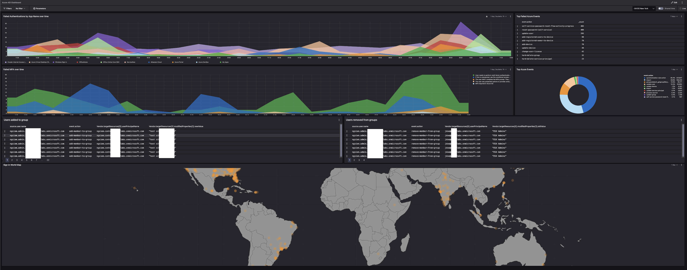

# Azure AD Dashboards
Import this dashboard to gain useful insights into Azure AD data. 

## Installation
1. Download the YAML file
2. Inside of Falcon, browse to: `NGSIEM` -> `Dashboards` -> `Create Dashboard` -> `Import Dashboards` - Select the YAML file
3. Search for `Azure-AD-Dashboard`
