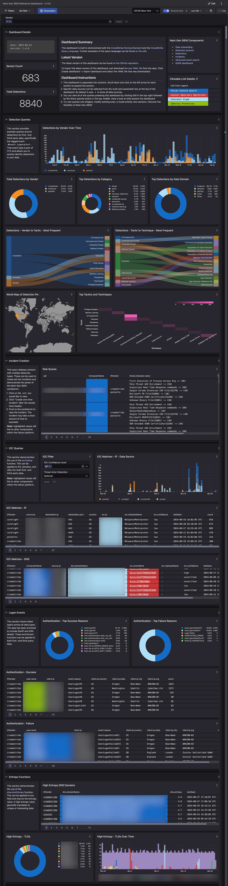
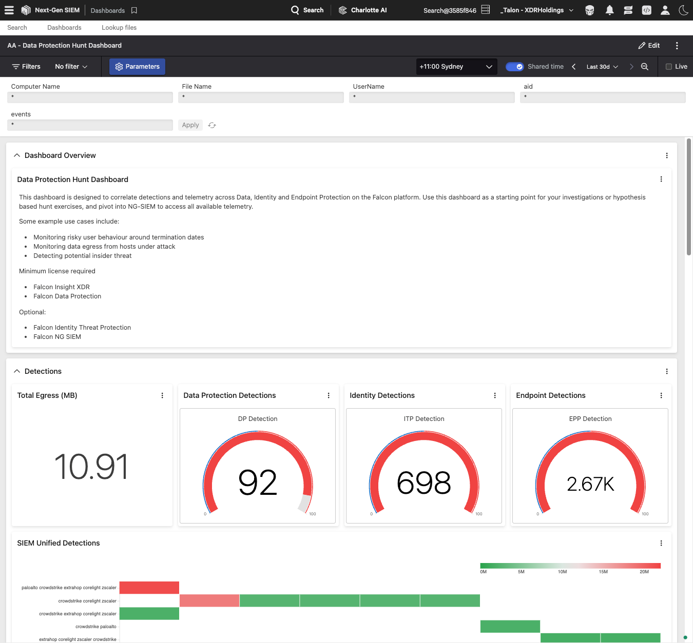
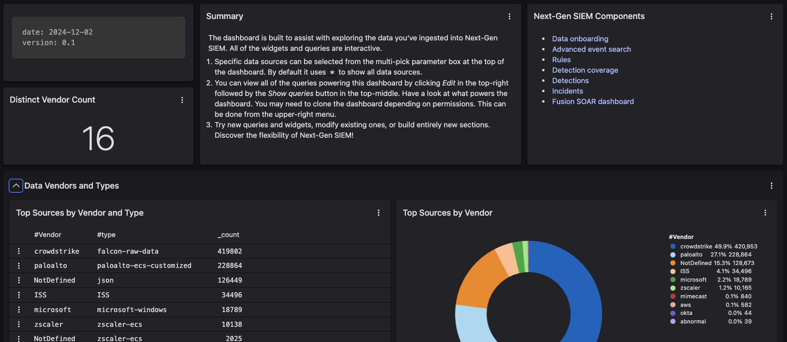

# Dashboard Screenshots

## Importing the Dashboard

1. Download the YAML file [here](next-gen-siem-reference-dashboard.yaml)
2. In Falcon, Click Menu -> Next-Gen SIEM -> Dashboards
3. Click Create Dashboards -> Import Dashboard
4. Upload the YAML file that you just downloaded
5. Click "Import"

## [next-gen-siem-reference-dashboard](next-gen-siem-reference-dashboard.yaml)

## [data-protection-hunt-dashboard](data-protection-hunt-dashboard.yaml)

## [next-gen-siem-third-party-data-explorer](next-gen-siem-third-party-data-explorer.yaml)
